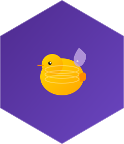

<p align="center">
  
</p>

# DuckDB Elixir

[](https://github.com/nshkrdotcom/duckdb_ex/actions/workflows/elixir.yaml)
[](https://elixir-lang.org)
[](https://www.erlang.org)
[](https://hex.pm/packages/duckdb_ex)
[](https://hexdocs.pm/duckdb_ex)
[](https://github.com/nshkrdotcom/duckdb_ex/blob/main/LICENSE)

A 100% faithful port of the [DuckDB Python client](https://github.com/duckdb/duckdb-python) to Elixir.

> **Status**: 🚧 Under active development - Not yet ready for production use

## About

This project is a complete port of the official DuckDB Python client to Elixir, providing:

- **100% API Parity**: All Python API functions ported with identical semantics
- **Native Performance**: Rust NIF layer for zero-overhead native integration
- **Idiomatic Elixir**: Elixir conventions while maintaining Python API compatibility
- **Comprehensive Testing**: All Python tests ported to ensure correctness

## Quick Start (When Available)

```elixir
# Add to mix.exs
def deps do
  [
    {:duckdb_ex, "~> 0.1.0"}
  ]
end
```

```elixir
# Basic usage
{:ok, conn} = DuckdbEx.connect(:memory)

# Execute SQL
{:ok, result} = DuckdbEx.execute(conn, "SELECT 42 as answer")
{:ok, [{42}]} = DuckdbEx.Result.fetch_all(result)

# Use relation API
{:ok, rel} = DuckdbEx.read_csv(conn, "data.csv")
rel
|> DuckdbEx.Relation.filter("age > 21")
|> DuckdbEx.Relation.order("name")
|> DuckdbEx.Relation.fetch_all()

# Close connection
DuckdbEx.close(conn)
```

## Development

### Prerequisites

- Docker and docker-compose
- Elixir 1.18+
- Rust (for NIF compilation)

### Getting Started

```bash
# Build Docker environment
docker-compose build

# Run tests
docker-compose run test

# Start development shell
docker-compose run dev

# In the dev shell
iex> DuckdbEx.Native.test_nif()
"NIF is working!"
```

### Project Structure

```
duckdb_ex/
├── docs/                      # Comprehensive documentation
│   ├── TECHNICAL_DESIGN.md    # Architecture and design
│   ├── IMPLEMENTATION_ROADMAP.md  # Phased implementation plan
│   └── PYTHON_API_REFERENCE.md    # Complete Python API catalog
├── AGENT_PROMPT.md            # Complete implementation guide
├── duckdb-python/             # Python client (reference implementation)
├── lib/duckdb_ex/             # Elixir modules
├── native/duckdb_nif/         # Rust NIF layer
└── test/                      # Ported test suite
```

## Documentation

Essential reading for contributors:

1. **[AGENT_PROMPT.md](AGENT_PROMPT.md)** - Complete implementation guide with TDD approach
2. **[docs/TECHNICAL_DESIGN.md](docs/TECHNICAL_DESIGN.md)** - Architecture and technical design
3. **[docs/IMPLEMENTATION_ROADMAP.md](docs/IMPLEMENTATION_ROADMAP.md)** - Phased implementation plan
4. **[docs/PYTHON_API_REFERENCE.md](docs/PYTHON_API_REFERENCE.md)** - Python API reference

## Implementation Progress

### Phase 0: Project Setup ⏳
- [x] Documentation created
- [ ] Docker environment
- [ ] Rustler setup
- [ ] Basic NIF skeleton
- [ ] Test infrastructure

### Phase 1: Core Foundation 🔜
- [ ] Connection management
- [ ] Basic query execution
- [ ] Result fetching
- [ ] Exception handling

### Future Phases
See [IMPLEMENTATION_ROADMAP.md](docs/IMPLEMENTATION_ROADMAP.md) for complete roadmap.

## Contributing

This project follows a strict Test-Driven Development (TDD) approach:

1. Port tests from `duckdb-python/tests/`
2. Tests must fail initially
3. Implement feature to make tests pass
4. Verify behavior matches Python client
5. Document any differences

See [AGENT_PROMPT.md](AGENT_PROMPT.md) for detailed contribution guidelines.

## Reference Implementation

This port is based on the official DuckDB Python client:
- Source: `duckdb-python/` directory in this repository
- Version: Latest stable release
- License: MIT

All implementation decisions reference the Python source code to ensure 100% compatibility.

## License

MIT License - see LICENSE file for details.

## Acknowledgments

- [DuckDB](https://duckdb.org/) - The amazing analytical database
- [DuckDB Python](https://github.com/duckdb/duckdb-python) - Reference implementation
- [Rustler](https://github.com/rusterlium/rustler) - Rust NIF framework
- [duckdb-rs](https://github.com/duckdb/duckdb-rs) - Rust DuckDB bindings

## Status and Roadmap

This project is in early development. Check:
- [IMPLEMENTATION_ROADMAP.md](docs/IMPLEMENTATION_ROADMAP.md) for detailed progress
- [GitHub Issues](https://github.com/your-repo/issues) for current work
- [CHANGELOG.md](CHANGELOG.md) for version history (when available)

## Support

For questions and discussions:
- Open an issue on GitHub
- Reference the Python client documentation
- Check the comprehensive docs in `docs/` directory
